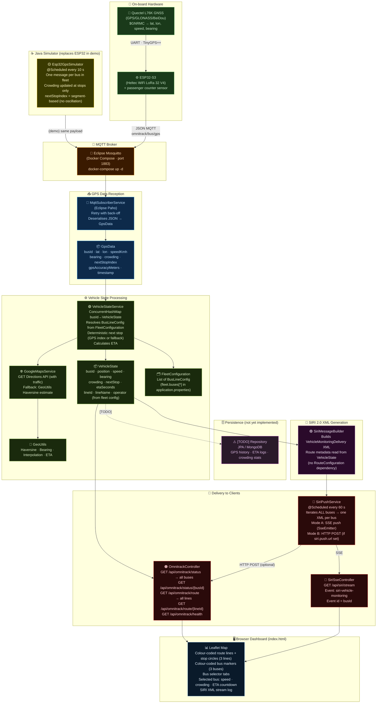

# OmniTrack CassiTrack — Real-Time Bus Monitoring System (SIRI 2.0)

Academic prototype — University of Cassino and Southern Lazio (UNICAS).
Simulates a complete fleet monitoring system based on:

- **ESP32** (Heltec WiFi LoRa 32 V4) + **GNSS** (Quectel L76K) on board the bus
- **MQTT** as the GPS data transport protocol
- **SIRI 2.0** (EN 15531) as the European standard for passenger information
- **SSE** (Server-Sent Events) or **HTTP POST** for pushing data to the CassiTrack central server
- **Google Maps Directions API** (with Haversine fallback) for ETA calculation

---

## Architecture and Data Flow




---

## Class Reference

| Layer | Class | Role |
|---|---|---|
| **Simulator** | `Esp32GpsSimulator` | Replaces real hardware: simulates all 3 buses, publishes GPS JSON to MQTT every 10 s |
| **Reception** | `MqttSubscriberService` | Subscribes to MQTT topic, deserialises JSON → `GpsData`, passes to service layer |
| **Input model** | `GpsData` | ESP32 payload DTO: position, speed, bearing, crowding, nextStopIndex |
| **Fleet config** | `FleetConfiguration` | Loads all bus lines from `application.properties` (`fleet.buses[*]`) |
| **Bus line** | `BusLineConfig` | One bus line: busId, lineId, lineName, operator, direction, stops |
| **Processing** | `VehicleStateService` | Core logic: resolves next stop, calculates ETA, stores `ConcurrentHashMap<busId, VehicleState>` |
| **ETA** | `GoogleMapsService` | ETA via Google Maps Directions API; Haversine fallback when no key |
| **Geo utilities** | `GeoUtils` | Haversine distance, bearing, linear interpolation, ETA estimate |
| **State model** | `VehicleState` | Current bus state: position, ETA, next stop, crowding, SIRI line metadata |
| **Stop model** | `RouteStop` | One stop: id, name, WGS84 coordinates, order |
| **SIRI builder** | `SiriMessageBuilder` | Generates SIRI 2.0 `VehicleMonitoringDelivery` XML from `VehicleState` |
| **Delivery** | `SiriPushService` | Pushes SIRI XML to SSE clients (and optionally via HTTP POST) — see below |
| **SSE endpoint** | `SiriSseController` | `GET /api/siri/stream` — manages `SseEmitter` list |
| **REST API** | `OmnitrackController` | `/status`, `/status/{busId}`, `/route`, `/route/{lineId}`, `/health` |
| **Dashboard** | `index.html` | Leaflet map + bus tabs + ETA countdown + SIRI stream log |

---

## SSE vs HTTP POST — Two Alternative Delivery Modes

`SiriPushService` supports two ways of sending SIRI 2.0 data to CassiTrack. They are **independent and can run simultaneously**, but a typical deployment uses only one.

### Mode A — SSE (Server-Sent Events) · *pull model*

```
CassiTrack server ──GET /api/siri/stream──► OmniTrack
                  ◄── event: siri-vehicle-monitoring ──
                  ◄── event: siri-vehicle-monitoring ──  (every 60 s, per bus)
```

- CassiTrack opens one persistent HTTP connection (keep-alive).
- OmniTrack pushes one SSE event per bus per cycle.
- **Use when**: CassiTrack can initiate outbound connections to OmniTrack.
- **Config**: always active (no extra config needed). Dashboard uses this mode.

### Mode B — HTTP POST · *push model*

```
OmniTrack ──POST /siri/notify──► CassiTrack server
          ◄── 200 OK ──
```

- OmniTrack proactively POSTs the SIRI XML to the configured URL.
- **Use when**: CassiTrack is behind a firewall and cannot accept incoming connections, or when a guaranteed delivery attempt per update is required.
- **Config**: set `siri.push.url=http://cassitrack-server/siri/notify` in `application.properties`.

Leave `siri.push.url` empty (the default) to use **SSE only**.

---

## MQTT Broker — Eclipse Mosquitto via Docker

The project uses **Eclipse Mosquitto 2.0** as the MQTT broker, running in Docker Compose.
The embedded Moquette broker has been removed.

```bash
# Start Mosquitto (required before running the application)
docker-compose up -d

# Then start the Spring Boot application
./mvnw spring-boot:run
```

The real **ESP32 hardware** (Heltec WiFi LoRa 32 V4) connects to `localhost:1883`.
The Spring Boot subscriber (`MqttSubscriberService`) connects to the same broker.
Both use retry logic with exponential back-off, so startup order does not matter.

Mosquitto configuration: [`mosquitto/mosquitto.conf`](mosquitto/mosquitto.conf)

---

## Fleet Configuration

Three bus lines are pre-configured in `application.properties` under `fleet.buses[*]`:

| Bus | Line | Direction |
|---|---|---|
| BUS-001 | CASSINO-LINE-1 | Railway Station → University (west) |
| BUS-002 | CASSINO-LINE-2 | Railway Station → Industrial Zone (east) |
| BUS-003 | CASSINO-LINE-3 | Piazza De Gasperi → Caira (north) |

To add a new bus line, append a `fleet.buses[N].*` block in `application.properties`.

---

## How the Bus Movement Simulation Works

The `Esp32GpsSimulator` mimics the behaviour of a real ESP32 + Quectel L76K GPS unit
publishing NMEA-derived data every 10 seconds.

### Step 1 — Route interpolation at startup

For each bus line, the simulator pre-computes a fixed array of GPS coordinates by
**linearly interpolating** between consecutive stops:

```
Stop A (lat₀, lon₀) ──────────────────── Stop B (lat₁, lon₁)
         │  t=0/20  t=1/20 … t=19/20    │
         ●────●────●────●────●────●────●────●
         step 0    1    2              19   step 20 = Stop B
```

`STEPS_PER_SEGMENT = 20` means 20 interpolated positions per leg.
With 5 stops and 4 legs, each bus has **80 total steps** (4 × 20).

```java
// Esp32GpsSimulator.buildRoute()
double t = (double) step / STEPS_PER_SEGMENT;   // 0.0 → 1.0
routeLats[idx] = GeoUtils.interpolate(from.lat, to.lat, t);
routeLons[idx] = GeoUtils.interpolate(from.lon, to.lon, t);
```

### Step 2 — Staggered start positions

To avoid all buses starting at the same stop, each bus is **offset** by a fraction
of the total route at startup:

```
BUS-001 starts at step  0 / 80  →  Cassino Railway Station (stop 0)
BUS-002 starts at step 27 / 80  →  ~middle of segment 1
BUS-003 starts at step 53 / 80  →  ~middle of segment 2
```

Formula: `startStep = busIndex × totalSteps / numberOfBuses`

This way the three buses appear spread across the map from the very first update.

### Step 3 — Scheduled publish every 10 seconds

`@Scheduled(fixedRateString = "${simulator.update.interval.ms:10000}")` fires every 10 s.
In each call, **all buses advance one step** and publish one MQTT message:

```
Tick  1: BUS-001 step  1 →  2,  BUS-002 step 28 → 29,  BUS-003 step 54 → 55
Tick  2: BUS-001 step  2 →  3,  BUS-002 step 29 → 30,  BUS-003 step 55 → 56
…
Tick 80: BUS-001 loops back to step 0 (wraps modulo totalSteps)
```

Speed and bearing are computed from the **difference between consecutive positions**,
exactly as a real GPS module derives them from satellite Doppler shift:

```java
double distMeters = GeoUtils.distanceMeters(prevLat, prevLon, lat, lon);
double speedKmh   = (distMeters / 10.0) * 3.6;   // Δdist (m) / Δtime (10 s) → km/h
double bearing    = GeoUtils.bearingDegrees(prevLat, prevLon, lat, lon);
```

A ±5 % white-noise term is added to speed to simulate GPS measurement jitter.

### Step 4 — Crowding updated only at stops

Crowding (`0–10`) is recalculated **only when the bus moves into a new segment**
(i.e. when `currentStep / STEPS_PER_SEGMENT` changes). This models the real sensor
behaviour where the passenger count changes only when someone boards or alights.

```java
if (currentSegment != lastCrowdingSegment) {
    currentCrowding = simulateCrowding(currentSegment, totalSegments);
    lastCrowdingSegment = currentSegment;
}
```

The crowding profile follows a **bell curve** over the route
(empty at the terminal ends, busiest at mid-route):

```
Crowding
  10 │          ▲
   8 │        ╱   ╲
   6 │      ╱       ╲
   4 │    ╱           ╲
   2 │  ╱               ╲
   0 ├──────────────────────▶ route progress
    Stop 0                Stop N
```

Formula: `base = (int)(10 × 4 × progress × (1 − progress))` + random noise `[−1, +1]`.

### Step 5 — Next stop index (deterministic)

Rather than computing the nearest stop by distance (which oscillates near stop boundaries),
the simulator embeds the **segment index** directly in the MQTT payload:

```java
int currentSegment = currentStep / STEPS_PER_SEGMENT;
int nextStopIndex  = Math.min(currentSegment + 1, stops.size() - 1);
data.setNextStopIndex(nextStopIndex);
```

`VehicleStateService` uses this value directly, avoiding the proximity-based ambiguity.
Real ESP32 devices that do not send `nextStopIndex` fall back to the server-side
proximity search automatically (`nextStopIndex = -1` triggers the fallback).

### Complete tick lifecycle

```
@Scheduled tick (every 10 s)
  └─ for each bus in fleet:
       1. lat, lon  ← routeLats/Lons[currentStep]
       2. bearing   ← Haversine bearing from prevLat/Lon
       3. speedKmh  ← (Δdist / 10 s) × 3.6  + noise
       4. segment   = currentStep / STEPS_PER_SEGMENT
       5. if segment changed → recalculate crowding (bell curve)
       6. nextStopIndex = segment + 1 (clamped)
       7. publish JSON to MQTT topic omnitrack/bus/gps
       8. currentStep = (currentStep + 1) % totalSteps  (circular route)
```

To change the simulation granularity, adjust `STEPS_PER_SEGMENT` in `Esp32GpsSimulator.java`
(higher = smoother movement, more MQTT messages per leg) or `simulator.update.interval.ms`
in `application.properties` (lower = faster updates).

---

## Not Yet Implemented

| Component | Description |
|---|---|
| **Database / Repository** | GPS history, ETA logs, crowding statistics — add with Spring Data JPA or MongoDB |
| **Authentication** | REST and SSE endpoints are currently unauthenticated |
| **SIRI subscription management** | Formal SIRI subscribe/unsubscribe request handling |

---

## Quick Start

```bash
# 1. Start the MQTT broker
docker-compose up -d

# 2. Start the application
./mvnw spring-boot:run
```

Dashboard: **http://localhost:8080**

```properties
# Optional overrides in application.properties
google.maps.api.key=AIzaSy…   # enables real-time traffic ETA
simulator.enabled=false        # disable simulator when using real ESP32 hardware
```

---

## Real Hardware

| Component | Model | Notes |
|---|---|---|
| MCU + LoRa | Heltec WiFi LoRa 32 V4 (ESP32-S3R2 + SX1262) | EU868 MHz, OLED, 3000 mAh battery |
| GNSS | Quectel L76K | GPS/GLONASS/BeiDou/QZSS, SH1.25-8P connector |
| Speed | From `$GNRMC` via `TinyGPS++` | `gps.speed.kmph()` — no calculation needed |
| Bearing | From `$GNRMC` via `TinyGPS++` | `gps.course.deg()` |
| Crowding | IR sensor at the door | Passenger counter (up/down events) |

To switch from simulator to real hardware:
1. Set `simulator.enabled=false`
2. Flash the ESP32 with the firmware (see sketch in `Esp32GpsSimulator` Javadoc)
3. Point the ESP32 to the MQTT broker host/port
